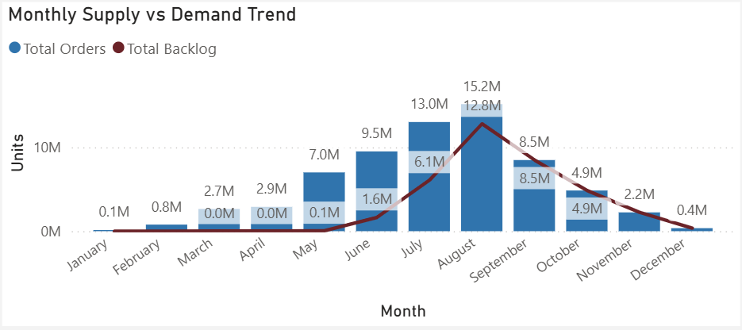
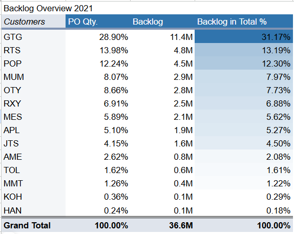

[← Back to Data Analytics Portfolio](https://github.com/KaraFang/Data-Analytics-Portfolio)

# Makalot Pandemic Output Analysis

> Note: The analysis was built using an anonymized version of real operational data. Sensitive details have been replaced or masked. The Power BI file remains private to comply with confidentiality requirements.

## Table of Contents

- [Project Background](#project-background)
- [Executive Summary](#executive-summary)
- [Key Insights](#key-insights)
- [Recommendations](#recommendations)
- [Assumptions and Caveats](#assumptions-and-caveats)

---

## Project Background

Makalot Industrial Co., a global apparel manufacturer supplying brands such as Gap, Uniqlo, and Roots, faced severe operational challenges during the pandemic as shipment delays caused rising warehouse congestion and fulfillment backlogs. As Makalot’s Production Manager at the time, I later revisited this real-world problem through the lens of a data analyst — combining domain expertise with technical skills to quantify backlog exposure, assess storage pressure, and uncover insights to support data-driven production and logistics decisions.

## Executive Summary

- An analysis of over 20K production orders in 2021 revealed that Makalot’s total backlog reached 36.6 million units, with more than 55% concentrated among three key buyers — GTG (31.2%), RTS (13.2%), and POP (12.3%).

- Backlog carried over from May (0.1M units), represented an unusual increase, likely driven by pandemic-related shipment delays or deferred customer schedules, warranting further review.

- Production demand peaked in September at 15.2M units, creating short-term warehouse congestion and fulfillment delays.

These findings highlight opportunities to balance production and shipment timing, smoothing volume fluctuations and reducing capacity strain during high-demand periods.

## Key Insights

### Backlog Trends

- Total backlog reached 36.6M units in 2021 (as of June 7).
- Volume peaked in September (15.2M units), indicating temporary production or logistics constraints.
- Backlog declined gradually toward year-end as operational flow stabilized.

### Buyer Concentration

- Top three buyers — GTG (31.2%), RTS (13.2%), and POP (12.3%) — made up over 55% of total backlog.
- This concentration highlights potential dependency risks and the importance of closer coordination with key accounts during disruption periods.

### Operational Capacity

- The September backlog spike indicates warehouse and shipment congestion.
- The 0.1M overdue backlog from May likely reflects early pandemic-driven bottlenecks, requiring root-cause analysis.
- Balanced scheduling and pull/push shipment strategies could help reduce future capacity overloads.

## Recommendations

### Supply & Logistics Agility

- **Diversify Shipment Scheduling**: Implement flexible pull-in/push-out strategies to balance workload during peak months (e.g., September).
- **Forecast Collaboration**: Strengthen cross-functional alignment among planning, logistics, and customer service to respond faster to demand volatility.

### Key Buyer Management

- **Strategic Account Coordination**: Focus on GTG, RTS, and POP with shared capacity visibility to minimize backlog risk.
- **Tiered Service Levels**: Prioritize fulfillment during constrained supply periods to protect key customer relationships.

### Capacity & Inventory Optimization

- **Utilization Thresholds**: Establish rolling warehouse and labor capacity alerts to flag bottlenecks early.
- **Scenario Planning**: Simulate alternate shipment pacing and manpower allocation to stabilize throughput under variable demand.

### Exception Monitoring & Root-Cause Control

- **Automated Alerts**: Deploy backlog deviation triggers to enable early intervention.
- **Root-Cause Reviews**: Analyze aged or overdue POs (e.g., May backlog) to reinforce contingency playbooks for future disruptions.

## Assumptions and Caveats

### Data Scope and Period:
The dataset covers production orders between January and December 2021, extracted from Makalot’s internal order records as of June 7, 2021. Orders completed or created after this date are not reflected, which may slightly understate late-year shipment recovery.

### Shipment Disruption Attribution:
Backlog drivers were inferred from production and order data only. The analysis assumes shipment delays, deferred customer schedules, or port congestion as primary causes but lacks direct logistics data to validate root causes.

### Capacity Metrics and Interpretation:
Warehouse and production utilization metrics were not covered in this report. These remain within the purview of the management team, who can integrate operational knowledge of space, workforce, and throughput with demand and backlog trends to evaluate capacity sufficiency.

### Future Analytical Expansion
With access to additional metrics such as warehouse capacity, labor availability, and actual daily output rates, this analysis could be extended to model capacity constraints, throughput efficiency, and predictive resource allocation, offering a more comprehensive view of operational resilience under disruption.

---

## Tools & Skills Used
- SQL (PostgreSQL): exploratory data analysis, Transformation, and view creation
- Power BI: visualization, trend analysis, and backlog KPI reporting
- Google Sheets: data cleaning, early-stage modeling and validation

---

📁 **My Professional Portfolio:** [Data Analytics Portfolio →](https://github.com/KaraFang/Data-Analytics-Portfolio)

